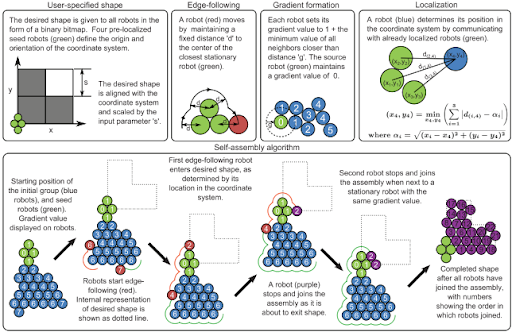
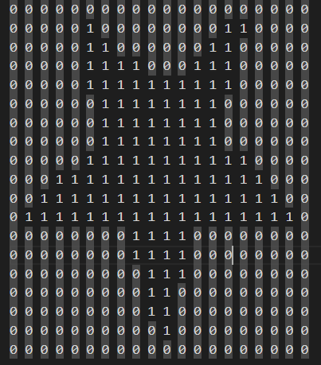
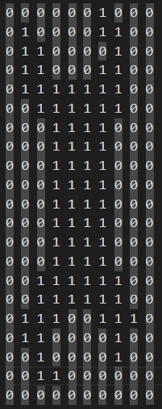
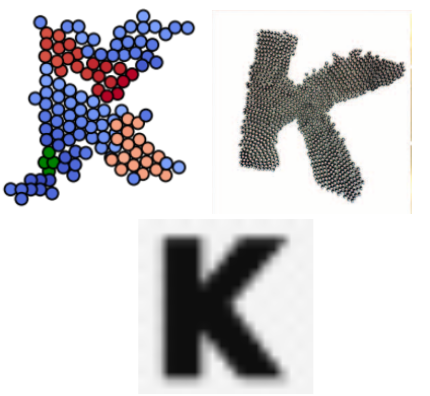
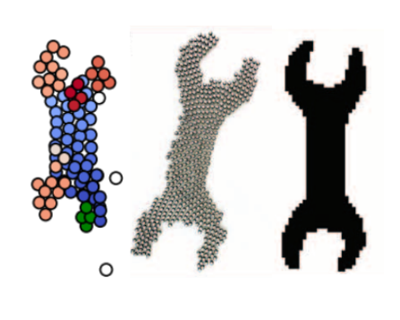
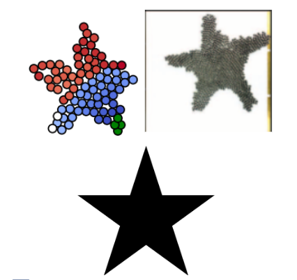

# Kilobot_swarm
An implementation of the Kilobot algorithm from "Coverage Control for Mobile Sensing Networks" in Python.

# Implmentation
This is a simulation of the algorithm designed it the paper to cordiante a robotic swarm using simple rules.

The formation is mapped with a bitmap image to define a boundry

# Result

The end result matched the algorithm but was limited by the number of bots able to be displayed. Rewrting this simulation would in C++ would lead to better results with speed and number of bots.

# Paper Cited
J. Cortés, S. Martínez, T. Karatas, and F. Bullo, "Coverage Control for Mobile Sensing Networks,"
